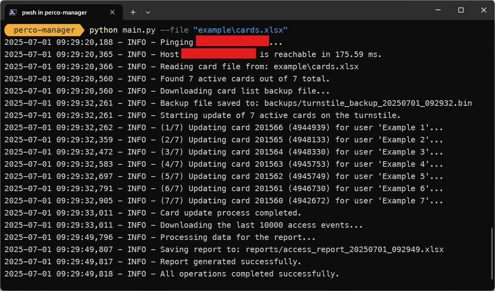

# PERCo-KT023: The Sanity-Saving Interface

> _Because navigating the original web interface is like ...very bad._

<p align="center">
    
</p>

## The Challenge

If you're here, you've likely discovered that the trusty **PERCo KT023** turnstile doesn't come with a modern REST API. In fact, it doesn't have an API at all.

What it _does_ have is an antique web interface, powered by a small embedded server, and a series of finicky CGI scripts. These scripts expect cryptic parameters that feel like a throwback to a different era of the web.

Need to add a card? You'll be crafting a GET request by hand. Need to download event logs? You'll be hoping a session timeout doesn't interrupt you. Need to do this for hundreds of users? You'll need a good cup of coffee and a lot of patience.

## The Solution

This repository provides a thin, sanity-saving layer over that web interface. It's a Python script that acts as a modern wrapper, allowing you to perform all the key operations from a clean and simple command-line interface.

It does the tedious work of "talking" to the turnstile's quirky CGI interface so you don't have to.

## Why not just publish a Postman collection?

...uuhm well...

Probably an implementation with json files instead of xlsx files would've been smarter, but back when I built this code the requirement was to use Excel sheets.

## Features

- **Preliminary Health Check:** Before doing anything, it pings the device to make sure it's online and ready for commands.
- **Card Management:** Reads a simple Excel file and patiently sends the data for all active cards to the PERCo, one by one.
- **Access Reporting:** Pulls the raw event logs from the device, cleans them up, and transforms them into a human-readable Excel report.
- **Configuration Backup:** Before performing an update, it downloads a binary backup of the current card list. Because you can never be too careful.

## Getting Started

Follow these steps to get up and running.

1.  **Clone the Repository**

    ```bash
    git clone https://github.com/gandomullac/perco-kt023-manager.git
    cd perco-kt023-manager
    ```

2.  **Create a Clean Workspace (Virtual Environment)**
    It's best practice to keep project dependencies isolated.

    ```bash
    python -m venv venv
    source venv/bin/activate  # On Windows: venv\Scripts\activate
    ```

    _... or don't, it's not that big of a deal probably._

3.  **Install Dependencies**
    This command reads the `requirements.txt` file and installs the necessary packages.

    ```bash
    pip install -r requirements.txt
    ```

4.  **Configure Your Environment (`.env`)**
    This is the most important step. This file tells the script how to connect to your turnstile.
    Copy the `.env.example` file to `.env` and fill in the required fields.

    ```bash
    cp .env.example .env
    ```

## Usage

Once everything is configured, you can run the script from the root directory.

**Default command (updates cards AND generates a report):**

```bash
python main.py --file "your_cards_file.xlsx"
```

## Contributing

Contributions are welcome! Feel free to open issues or submit pull requests to improve the project.

## License

This project is licensed under the [Unlicense](https://unlicense.org/), which allows you to do anything you want with it. I literally couldn't care less.
